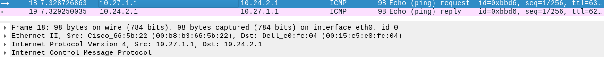

<!-- markdownlint-disable MD051 MD024 -->
# Compte rendu du TP 2 InfraSec : Mise en place IPSec <!-- omit from toc -->

> Ce compte rendu a été fait par :
>
> - Poste 24 (N)
>   - Damien **ROCABOIS**
>   - Mathys **PERSON**
> - Poste 27 (M)
>   - Matthias **HARTMANN**
>   - Quentin **NOILOU**
> Groupe 2A1 RT

## Table des matières <!-- omit from toc -->

1. [Mise en place des deux sites](#mise-en-place-des-deux-sites)
   1. [Poste 24](#poste-24)
   2. [Poste 27](#poste-27)
2. [Mise en place d'un double tunnel IPSec avec clefs manuelles](#mise-en-place-dun-double-tunnel-ipsec-avec-clefs-manuelles)
   1. [Éléments de configuration](#%C3%A9l%C3%A9ments-de-configuration)
   2. [Mise en place du premier tunnel IPSec en AH](#mise-en-place-du-premier-tunnel-ipsec-en-ah)
   3. [Mise en place du second tunnel IPSec en ESP](#mise-en-place-du-second-tunnel-ipsec-en-esp)
3. [Utilisation du protocole IKE avec "PRE-SHARE KEY" pour la création des SA IPSec et des clefs de sessions IPSec](#utilisation-du-protocole-ike-avec-%22pre-share-key%22-pour-la-cr%C3%A9ation-des-sa-ipsec-et-des-clefs-de-sessions-ipsec)
   1. [Rappels](#rappels)
   2. [Opérations à effectuer pour mettre en oeuvre IKE](#op%C3%A9rations-%C3%A0-effectuer-pour-mettre-en-oeuvre-ike)
   3. [Travail à Réaliser](#travail-%C3%A0-r%C3%A9aliser)
4. [Utilisation du protocole IKE avec des clefs publiques RSA pour l'échange des clefs de sessions IPSec](#utilisation-du-protocole-ike-avec-des-clefs-publiques-rsa-pour-l%C3%A9change-des-clefs-de-sessions-ipsec)
   1. [Opération à effectuer pour mettre en oeuvre IKE avec des clefs RSA](#op%C3%A9ration-%C3%A0-effectuer-pour-mettre-en-oeuvre-ike-avec-des-clefs-rsa)
   2. [Travail à réaliser](#travail-%C3%A0-r%C3%A9aliser-1)

## Mise en place des deux sites

### Poste 24

Fonctionnement du serveur apache:


Testes de connectivité:


### Poste 27

Fonctionnement du serveur apache:

```txt
apache2.service - The Apache HTTP Server
     Loaded: loaded (/lib/systemd/system/apache2.service; disabled; vendor pres>
     Active: active (running) since Mon 2023-03-13 13:50:10 CET; 21min ago
       Docs: https://httpd.apache.org/docs/2.4/
    Process: 2325 ExecStart=/usr/sbin/apachectl start (code=exited, status=0/SU>
   Main PID: 2465 (/usr/sbin/apach)
      Tasks: 10 (limit: 9337)
     Memory: 37.0M
        CPU: 143ms
     CGroup: /system.slice/apache2.service
             ├─2465 /usr/sbin/apache2 -k start
             ├─2468 /usr/sbin/apache2 -k start
             ├─2491 /usr/sbin/apache2 -k start
             ├─2492 /usr/sbin/apache2 -k start
             ├─2493 /usr/sbin/apache2 -k start
             ├─2494 /usr/sbin/apache2 -k start
             ├─2495 /usr/sbin/apache2 -k start
             ├─4805 /usr/sbin/apache2 -k start
             ├─4919 /usr/sbin/apache2 -k start
             └─4920 /usr/sbin/apache2 -k start

mars 13 13:50:09 G27 systemd[1]: Starting The Apache HTTP Server...
mars 13 13:50:10 G27 apachectl[2347]: AH00558: apache2: Could not reliably dete>
root@G27:~# 

```

Tests de connectivité:

```txt
root@G27:~# ping 10.27.1.1 -c 1 
PING 10.27.1.1 (10.27.1.1) 56(84) bytes of data.
64 bytes from 10.27.1.1: icmp_seq=1 ttl=63 time=0.321 ms

--- 10.27.1.1 ping statistics ---
1 packets transmitted, 1 received, 0% packet loss, time 0ms
rtt min/avg/max/mdev = 0.321/0.321/0.321/0.000 ms
root@G27:~# ping 10.254.27.1 -c 1 
PING 10.254.27.1 (10.254.27.1) 56(84) bytes of data.
64 bytes from 10.254.27.1: icmp_seq=1 ttl=255 time=0.230 ms

--- 10.254.27.1 ping statistics ---
1 packets transmitted, 1 received, 0% packet loss, time 0ms
rtt min/avg/max/mdev = 0.230/0.230/0.230/0.000 ms
root@G27:~# ping 10.254.0.254 -c 1 
PING 10.254.0.254 (10.254.0.254) 56(84) bytes of data.
64 bytes from 10.254.0.254: icmp_seq=1 ttl=63 time=0.519 ms

--- 10.254.0.254 ping statistics ---
1 packets transmitted, 1 received, 0% packet loss, time 0ms
rtt min/avg/max/mdev = 0.519/0.519/0.519/0.000 ms
root@G27:~# 

root@G27:~# ping 10.254.24.1 -c 1 
PING 10.254.24.1 (10.254.24.1) 56(84) bytes of data.
64 bytes from 10.254.24.1: icmp_seq=1 ttl=253 time=0.509 ms

--- 10.254.24.1 ping statistics ---
1 packets transmitted, 1 received, 0% packet loss, time 0ms
rtt min/avg/max/mdev = 0.509/0.509/0.509/0.000 ms
root@G27:~# ping 10.24.1.1 -c 1 
PING 10.24.1.1 (10.24.1.1) 56(84) bytes of data.
64 bytes from 10.24.1.1: icmp_seq=1 ttl=61 time=0.671 ms

--- 10.24.1.1 ping statistics ---
1 packets transmitted, 1 received, 0% packet loss, time 0ms
rtt min/avg/max/mdev = 0.671/0.671/0.671/0.000 ms
root@G27:~# ping 10.24.2.1 -c 1 
PING 10.24.2.1 (10.24.2.1) 56(84) bytes of data.
64 bytes from 10.24.2.1: icmp_seq=1 ttl=61 time=0.644 ms

--- 10.24.2.1 ping statistics ---
1 packets transmitted, 1 received, 0% packet loss, time 0ms
rtt min/avg/max/mdev = 0.644/0.644/0.644/0.000 ms
root@G27:~# 

```

## Mise en place d'un double tunnel IPSec avec clefs manuelles

### Mise en place du premier tunnel IPSec en AH

#### Poste24

Mise en place de la transform-set:

```cisco
access-list 100 permit tcp 10.24.0.0 0.0.255.255 10.27.0.0 0.0.255.255
crypto ipsec transform-set mon_trans_set_ah ah-sha-hmac
mode tunnel
exit
```

Mise en place de la crypto map:

```cisco
crypto map ma_premiere_map 20 ipsec-manual
match address 100
set peer 10.254.27.1
set transform-set mon_trans_set_ah
set session-key inbound ah 256 BBBB
set session-key outbound ah 256 AAAA
exit
int G0/0/1
crypto map ma_premiere_map
```

Capture apache :

Capture ping:


#### Poste27

Mise en place de la transform-set:

```cisco
access-list 100 permit tcp 10.27.0.0 0.0.255.255 10.24.0.0 0.0.255.255
crypto ipsec transform-set mon_trans_set_ah ah-sha-hmac
mode tunnel
exit
```

Mise en place de la crypto map:

```cisco
crypto map ma_premiere_map 20 ipsec-manual
match address 100
set peer 10.254.24.1
set transform-set mon_trans_set_ah
set session-key inbound ah 256 AAAA
set session-key outbound ah 256 BBBB
exit
int G0/0/1
crypto map ma_premiere_map
```

Capture apache :

Capture ping:


#### Interprétation

> Premièrement, on remarque l'encapsulation des échanges TCP (avec le serveur Apache). Cela se remarque par l'apparition de la partie `Authentication Header`.
> Deuxièmement, on remarque que cette encapsulation n'est pas présente sur l'échange ICMP (ping)
> On peut donc en conclure que le tunnel IPSec n'est effectué que sur les flux TCP. (Ce qui correspond au cahier des charges et à l'ACL mise en place)

### Mise en place du second tunnel IPSec en ESP

#### Poste24

Mise en place de la transform-set:

```cisco
access-list 101 permit tcp 10.24.1.0 0.0.0.255 host 10.27.2.1 eq 22
crypto ipsec transform-set mon_trans_set_esp esp-des
mode tunnel
exit
```

Mise en place de la crypto map:

```cisco
crypto map ma_premiere_map 19 ipsec-manual
match address 101
set peer 10.254.27.1
set transform-set mon_trans_set_esp
set session-key inbound esp 256 cipher BBBB
set session-key outbound esp 256 cipher AAAA
exit
int G0/0/1
crypto map ma_premiere_map
```

Capture SSH:

Capture ping:


#### Poste27

Mise en place de la transform-set:

```cisco
access-list 101 permit tcp host 10.27.2.1 eq 22 10.27.1.0 0.0.0.255
crypto ipsec transform-set mon_trans_set_esp esp-des
mode tunnel
exit
```

Mise en place de la crypto map:

```cisco
crypto map ma_premiere_map 19 ipsec-manual
match address 101
set peer 10.254.24.1
set transform-set mon_trans_set_esp
set session-key inbound esp 256 cipher AAAA
set session-key outbound esp 256 cipher BBBB
exit
int G0/0/1
crypto map ma_premiere_map
```

#### Interprétation

> On remarque que WireShark montre une encapsulation du flux ssh par ESP. Cela correspond bien à la configuration mise en place.
> On remarque aussi que les comportements précédents (apache et ping) restent identique.
> On peut donc conclure que le tunnel IPSec n'est effectif que sur le flux SSH du réseau utilisateur du poste24 vers le serveur SSH du poste27

## Utilisation du protocole IKE avec "PRE-SHARE KEY" pour la création des SA IPSec et des clefs de sessions IPSec

### Rappels

### Opérations à effectuer pour mettre en oeuvre IKE

### Travail à Réaliser

#### Poste 27

```cisco
access-list 110 permit IP any any
no crypto map
crypto isakmp enable
crypto isakmp policy 10
authentication pre-share
crypto isakmp key AAAA address 10.254.24.1

crypto ipsec transform-set mon_trans_set_ike esp-des
mode tunnel

crypto map ma_map_ike 20 ipsec-isakmp
set transform-set mon_trans_set_ike
set peer 10.254.24.1
match address 110


int G0/0/1
crypto map ma_map_ike
```

#### Poste 24

```cisco
access-list 110 permit IP any any
no crypto map
crypto isakmp enable
crypto isakmp policy 10
authentication pre-share
crypto isakmp key AAAA address 10.254.27.1

crypto ipsec transform-set mon_trans_set_ike esp-des
mode tunnel

crypto map ma_map_ike 20 ipsec-isakmp
set transform-set mon_trans_set_ike
set peer 10.254.27.1
match address 110


int G0/0/1
crypto map ma_map_ike
```

#### Interprétation


## Utilisation du protocole IKE avec des clefs publiques RSA pour l'échange des clefs de sessions IPSec

### Travail à réaliser

#### Poste 27

```cisco

ip domain name poste27
hostname routeur27
crypto key generate rsa signature
show crypto key mypubkey rsa

```

On a par la suite échangé les clés

puis :

```cisco
crypto key pubkey-chain rsa
addressed-key 10.254.24.1
key-string
[clé]

quit
```

#### Différences

Les trames Quick mode sont des messages de contrôle ISAKMP utilisés pour négocier les paramètres de sécurité pour la communication de données en utilisant le protocole IPsec. Pendant la phase de Quick mode, les deux parties négocient les paramètres de sécurité, tels que les algorithmes de chiffrement et d'authentification, et génèrent les clés de chiffrement et d'authentification qui seront utilisées pour protéger les données. Les trames Quick mode sont échangées après la phase d'établissement de la connexion (phase d'initiation de la connexion et phase de réponse de la connexion) de l'ISAKMP.

D'un autre côté, les trames informational sont des messages de contrôle ISAKMP utilisés pour transmettre des informations de gestion de clés. Ces messages peuvent être utilisés pour indiquer la fin d'une association de sécurité, signaler une erreur ou une condition exceptionnelle, ou transmettre des informations supplémentaires à l'association de sécurité en cours. Les trames informational ne sont pas utilisées pour négocier les paramètres de sécurité, mais plutôt pour maintenir et gérer les associations de sécurité en cours.

Lorsqu'on a ajouté une clé RSA à notre communication IPsec/ISAKMP, cela a probablement ajouté une couche supplémentaire de sécurité à notre communication. La présence de cette clé RSA peut avoir conduit à l'échange de trames informational en plus des trames Quick mode. Les trames informational peuvent contenir des informations sur la clé RSA, telles que la date d'expiration de la clé ou l'identité de l'émetteur de la clé, qui doivent être transmises aux deux parties pour maintenir l'association de sécurité.
