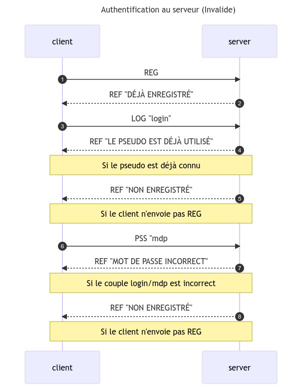

<!-- markdownlint-disable MD051 MD025 MD033 -->
# Compte rendu du projet SAE3.02 <!-- omit from toc -->

Par HARTMANN Matthias et SANDRA Valentin

## Table des matières <!-- omit from toc -->

1. [Gestion du projet](#gestion-du-projet)
   1. [Organisation interne de l'équipe](#organisation-interne-de-l%C3%A9quipe)
   2. [Organisation des tâches](#organisation-des-t%C3%A2ches)
   3. [Support de communication](#support-de-communication)
2. [Fonctionnalités](#fonctionnalit%C3%A9s)
   1. [Rappel du cahier des charges](#rappel-du-cahier-des-charges)
      1. [Cahier des charges obligatoire du projet](#cahier-des-charges-obligatoire-du-projet)
      2. [Cahier des charges de la solution](#cahier-des-charges-de-la-solution)
      3. [Améliorations éventuelles](#am%C3%A9liorations-%C3%A9ventuelles)
   2. [Protocole mis en place](#protocole-mis-en-place)
      1. [Mots clés du protocole](#mots-cl%C3%A9s-du-protocole)
      2. [Diagramme des échanges](#diagramme-des-%C3%A9changes)

## Gestion du projet

### Organisation interne de l'équipe

Afin de produire efficacement l'application, nous avons décidé de diviser le travail en deux parties.

- Le Front End
- Le Back End

Le front end, c'est à dire toutes les interfaces utilisateurs ont été faites par Valentin.
Le back end, c'est à dire la gestion de connexions, des bases de données et du serveur, a été fait par Matthias.

La mise en relation des deux parties a été faite majoritairement par Valentin car la charge de travail du front end était la plus petite.

### Organisation des tâches

Vous retrouverez ci-dessous un digramme Gantt montrant l'avancée du projet en fonction des semaines et de la division du travail.


### Support de communication

Pour assurer la communication interne à l'équipe nous avons utilisé le logiciel `Discord`, nous faisions nos réunions dessus pendant les heures d'autonomie. De plus nous avons utilisé le logiciel de versionnage `github` afin d'enregistrer notre travail et de plus facilement voir son évolution.

## Fonctionnalités

### Rappel du cahier des charges

Les éléments présents dans la solution commencent par :white_check_mark:, les éléments non présents commencent par :red_circle:

#### Cahier des charges obligatoire du projet

- :white_check_mark: Création d'une application client/serveur basé sur un ou plusieurs protocols de transport (TCP/UDP)
- :white_check_mark: Utilisation d'un protocol applicatif, d'une base de donnée ~~ou d'un système de fichier~~.
- :white_check_mark: Programmation en Python (*Ici en Python 3.9*)
- :white_check_mark: Application coté client unique pour tous les clients
- :white_check_mark: Création d'une interface graphique avec une option pour les paramètres les éléments réseaux
- :white_check_mark: Utilisation du processus de sérialisation et désérialisation.

#### Cahier des charges de la solution

- :white_check_mark: Un client doit pouvoir ouvrir le SoftPhone, s'enregistrer sur le serveur ou bien se connecter s'il est déjà enregistré
- :white_check_mark: Le client doit pouvoir avoir accès à la liste des clients connectés sur le serveur
- :red_circle: Le client doit pouvoir changer son mot de passe ou bien son nom/pseudo
- :white_check_mark: Le client ne doit pas pouvoir être en mesure d'obtenir l'adresse ip d'un autre client
- :white_check_mark: Le client doit pouvoir se déconnecter
- :white_check_mark: Le client doit recevoir des informations lorsqu'il est en appel. (temps d'appel, nom du correspondant...)
- :white_check_mark: Le client doit pouvoir créer un annuaire téléphonique lui permettant d'enregistrer le nom de certains clients afin de facilement les rappeler

- :white_check_mark: Le serveur doit pouvoir enregistrer les actions opérées (LOG)
- :white_check_mark: Le serveur doit pouvoir obtenir des informations sur un client
- :white_check_mark: Le serveur doit pouvoir être contrôlé à l'aide de commandes (Graphique ~~ou Non)~~
- :white_check_mark: Le serveur doit pouvoir gérer plusieurs  clients en même temps (au moins 2)

#### Améliorations éventuelles

- :white_check_mark: Possibilité de faire sonner un client (appel non immédiat)
  - :white_check_mark: Interface permettant d'accepter ou non un appel entrant
  - :red_circle: Interface permettant de mettre en attente un appel et de décrocher un autre
- :red_circle: Mettre en place un système de statut d'apparence (Disponible, Absent, Occupé..)
- :white_check_mark: Mise en place de ConfCall (Appel avec plus de 2 interlocuteurs)

 <div style='page-break-before: always;' />

### Protocole mis en place

Nous avons créer notre propre protocole, vous retrouverez la liste des mots clés ainsi que des diagrammes d'échange ci-dessous.

#### Mots clés du protocole

```txt
   REG ➡ Lance le processus d'authentification
   LOG ➡ Donne le nom d'utilisateur "log <username>"
   PSS ➡ Donne le mot de passe "pss <password>"
   AUT ➡ Informe que le client est authentifié
   CRE ➡ Créer un utilisateur "cre <username> <password>"
   # Qualité de service
   VLD ➡ Retour Valide
   REF ➡ Retour erreur "ref [pourquoi]"
   ENT ➡ Ferme la connexion TCP
   NUL ➡ Mot clé par défaut
   # Commands
   LSR ➡ Retourne la liste des clients connectés "lsr <username> <username> ..."
   LSD ➡ Demande la liste des clients connectés "lsd <username> <username> ..."

   CAL ➡ Prépare un appel "cal <username> [usernames...]"
   ASK ➡ Notifie un client qu'un appel lui est assigné "ask <callName>"
   RES ➡ Accepte ou non l'appel "res <bool:1|0>"
   STA ➡ Démarre l'appel
   INF ➡ Informations générales à l'appel "info time:00h00m00s act:usr1,usr2,usr3,..."
   FIN ➡ Termine l'appel
```

#### Diagramme des échanges





