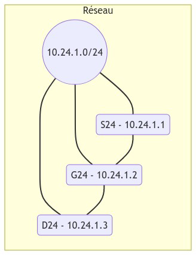
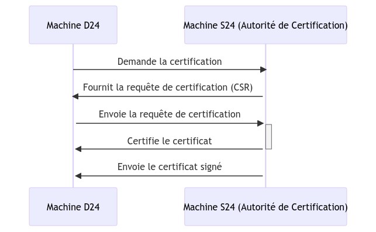
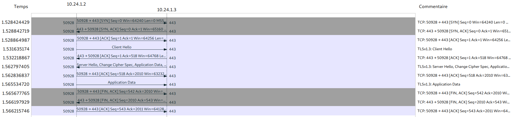
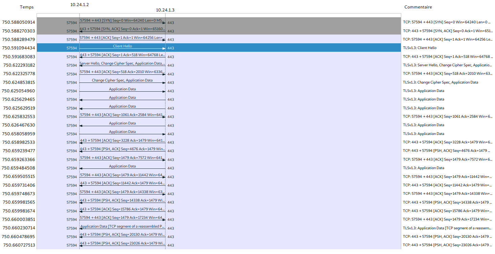
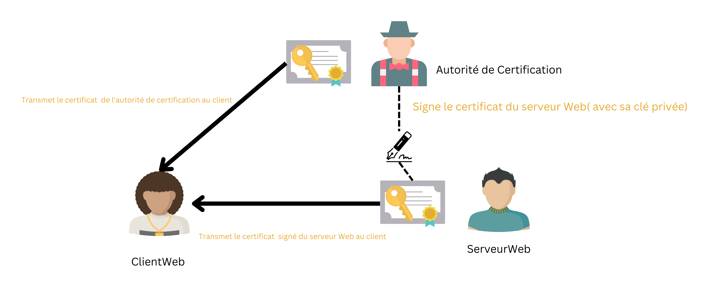

# Compte rendu du TP 1 SecuServ : HTTPS

> Ce Compte rendu a été réalisée par
>
> - NOILOU Quentin
> - HARTMANN Matthias

## Architecture de la manipulation

Le réseau sera le suivant:



Vérification du lancement du service apache2 sur $D_{24}$ :

```txt
root@D24:~# systemctl status apache2
● apache2.service - The Apache HTTP Server
     Loaded: loaded (/lib/systemd/system/apache2.service; disabled; vendor preset>
     Active: active (running) since Tue 2023-03-14 13:46:19 CET; 3min 20s ago

```

Vérification de l'accès au serveur Web $D_{24}$ depuis $G_{24}$ :

```bash
curl www.monsite.fr
```

## Réalisation d'un échange sécurisé HTTPS - version 1

### Création de l'autorité de certification sur $S_{24}$

Commandes Utilisées sur $S_{24}$:

```bash
mkdir /home/certification
mkdir /home/certification/maCA
cd /home/certification/maCA
openssl req -new -x509 -days 365 -extensions v3_ca -keyout private/cle-CA.pem -out certs/cacert.pem -config /etc/ssl/openssl.cnf
```

> - Le PEM Passphrase sert à chiffrer la clé privée en PEM. Il sera demandé à chaque fois qu'il faudra utiliser la clé privée.
> - Le CA a une validité de 365 jours (l'option `-days 365` ) alors que le certificat créé a une validité d'un mois.

Résultat des commandes :

```console
root@S24:/home/certification/maCA# openssl req -new -x509 -days 365 -extensions v3_ca -keyout private/cle-CA.pem -out certs/cacert.pem -config /etc/ssl/openssl.cnf
Generating a RSA private key
................................+++++
.......+++++
writing new private key to 'private/cle-CA.pem'
Enter PEM pass phrase:
Verifying - Enter PEM pass phrase:
-----
You are about to be asked to enter information that will be incorporated
into your certificate request.
What you are about to enter is what is called a Distinguished Name or a DN.
There are quite a few fields but you can leave some blank
For some fields there will be a default value,
If you enter '.', the field will be left blank.
-----
Country Name (2 letter code) [AU]:FR
State or Province Name (full name) [Some-State]:Bretagne
Locality Name (eg, city) []:Lannion
Organization Name (eg, company) [Internet Widgits Pty Ltd]:IUT Lannion
Organizational Unit Name (eg, section) []:
Common Name (e.g. server FQDN or YOUR name) []:www.ca.fr
Email Address []:admin@ca.fr
```

### Création d'une clé sur $D_{24}$

Commandes utilisées:

```bash
openssl genrsa -out www.monsite.fr.priv.key 4096
openssl req -new -key www.monsite.fr.priv.key -out www.monsite.fr.csr
openssl. req -in www.monsite.fr.csr -text -noout
```

Résultat des commandes :

```console
Certificate Request:
    Data:
        Version: 1 (0x0)
        Subject: C = FR, ST = Bretagne, L = Lannion, O = IUT Lannion, CN = www.monsite.fr, emailAddress = admin@monsite.fr
        Subject Public Key Info:
            Public Key Algorithm: rsaEncryption
                RSA Public-Key: (4096 bit):2e:c9:84:4f:
                    6b:a5:0a:77:87:56:d7:08:3f:1d:b3:3a:2f:8f:23:
                    b7:9b:6d
                Exponent: 65537 (0x10001)
        Attributes:
            challengePassword        :lannion
    Signature Algorithm: sha256WithRSAEncryption
         20:65:cd:48:ff:df:36:7f:92:e4:08:8f:7f:ca:74:e1:31:55:
         7a:d7:3d:64:99:33:f5:8c:dd:c5:a1:9c:39:0b:4c:6a:fb:fa:
         8b:f4:63:b4:d9:2f:d1:18:41:f8:8c:03:7c:42:bc:71:f7:01:
         4b:d6:cd:f4:6d:cd:f5:79:9a:d3:06:7f:f1:36:b1:71:c3:fd:
         39:ca:91:fa:b9:5a:a2:fc:d8:2e:d1:8e:05:0a:9f:93:4f:e0:
         5e:9d:bf:b4:f0:9c:7f:75:99:ba:3e:e8:ab:5e:ca:57:41:87:
         63:01:c8:b4:77:ab:26:d2:25:cf:3f:21:7a:82:aa:ef:ef:0e:
         fa:9b:44:33:c3:b4:75:da:14:ca:59:5b:20:9e:28:69:cf:b7:
         e3:37:a7:77:f0:0a:76:65:f9:83:34:4e:f1:fe:07:2b:b9:10:
         e6:26:04:bc:36:df:fd:e5:6c:70:81:7b:7a:21:0f:f9:a7:6b:
         ac:02:18:5d:aa:20:cf:f4:34:9c:ba:95:c9:28:a4:55:f9:46:
         94:83:1a:71:a4:3c:65:b9:60:4f:f6:2f:e4:55:1e:09:c3:5b:
         0c:68:bc:ef:e2:56:c9:48:9f:3b:8f:8b:3c:ad:ca:f4:e1:2a:
         1f:77:27:99:80:b9:f8:9d:e1:66:5f:e1:2d:df:40:f1:45:cc:
         54:ab:7e:f9:d5:12:2e:f6:fa:83:96:32:97:a3:6f:9d:17:8a:
         d0:2a:3d:20:70:41:9b:93:f7:06:2f:19:6c:93:2e:d9:57:82:
         05:ec:a1:13:01:03:b9:13:38:53:d6:c8:00:64:60:38:51:d2:
         a8:19:60:51:50:47:dc:79:4d:49:af:1a:cd:9b:56:31:04:9a:
         16:d5:14:fe:d1:ff:17:c3:6e:ae:e0:9c:12:ea:a2:25:63:1f:
         93:18:b5:c6:e9:1e:7e:89:7c:01:12:81:3e:af:93:52:0c:04:
         44:9d:b0:e5:34:51:80:e1:4c:2b:d7:0c:f0:a9:a8:f7:26:64:
         f7:26:38:c0:f2:6b:7e:41:b7:46:20:2a:32:43:52:30:f1:e3:
         8b:fc:0c:f5:02:8d:af:7c:7e:aa:66:42:fe:87:f6:8e:cc:ae:
         12:5b:35:12:94:f1:92:c0:6c:e2:f9:70:7a:8d:22:4b:a5:3f:
         5c:c7:a4:71:44:e3:a6:e9:60:fd:e4:12:3d:9c:a8:4f:52:23:
         d2:23:84:c6:75:b4:48:44:cb:8c:04:3e:9a:b8:6d:a6:81:7a:
         ac:fc:04:09:2e:99:9b:99:57:e6:d4:61:0e:0a:b6:8e:3a:7f:
         8d:12:43:3e:5f:b7:af:d1:15:bb:57:86:44:2d:51:a3:a4:ad:
         40:b5:26:50:d7:6b:83:2b
```

> Description des sections:
>
> - Data : Contient la version du certificat (Version), et l'identité vérifiée par le certificat (Subject)
>   - C(Country) Pays
>   - ST(State) Région
>   - L(Localisation) Ville
>   - O(Organisation) Organisation
>   - CN(Common Name) Url du site
>   - emailAddress L'adresse email du webmaster
> - Subject Public Key Info: La clé publique de la machine certifiée. (Avec les paramètres de la clé RSA publique)

### Certification de votre clé par la CA de $S{24}$

Commandes utilisées:

```bash
root@S24:/home/certification/maCA# openssl x509 -req -in www.monsite.fr.csr -out www.monsite.fr.crt -CA certs/cacert.pem -CAkey private/cle-CA.pem -CAcreateserial -CAserial ca.srl -extfile www.monsite.fr.alt 
Signature ok
subject=C = FR, ST = Bretagne, L = Lannion, O = IUT Lannion, CN = www.monsite.fr, emailAddress = admin@monsite.fr
Getting CA Private Key
Enter pass phrase for private/cle-CA.pem:
```

> - Le paramètre représentant le certificat signé pour le site web est `-out www.monsite.fr.crt`
> - `-req -in www.monsite.csr` : indique qu'on veut certifiée le fichier en in
> - `-CA` : la clé publique de l'autorité de certification
> - `-CAkey` : la clé privée de l'autorité de certification
> - `-CAcreateserial` :  indique à OpenSSL de créer un nouveau fichier de numéro de série pour le certificat CA si celui-ci n'existe pas encore. Si le fichier existe déjà, OpenSSL lèvera une erreur.
> - `-CASerial` : permet de spécifier le chemin d'accès au fichier de numéro de série existant pour le certificat CA. Si cette option n'est pas utilisée, OpenSSL recherche un fichier nommé "serial" dans le répertoire de travail actuel.
> - `-extfile` spécifie le chemin d'accès à un fichier d'extension de configuration qui contient les paramètres d'extension à inclure dans le certificat.
>
> Ces paramètres sont nécessaires car il faut absolument donner la clé privée et publique de l'autorité de certification, de plus il faut un numéro de série pour le logging.
>
> Description des sections du certificat :
>
> - Data : Les informations du certificat
>   - La version du certificat (Version)
>   - Le numéro de série (Serial Number)
>   - L'algorithme de signature (Signature Algorithm)
>   - L'identité du CA (Issuer)
>   - La validité du certificat (Validity)
>   - L'identité de la machine certifiée
> - La clé publique de la machine certifiée (Subject Public Key Info)
> - L'algorithme de signature (Signature Algorithm)
> - X509v3 Extension avec les noms alternatifs.

Schéma de certification détaillé:



### Sécurisation de vos communications avec HTTPS

> Nous devons mettre l'url `https://www.monsite.fr` afin de nous connecter en TLS/SSL au serveur $D_{24}$
> Lorsque nous faisons cela, Firefox nous prévient qu'il y a un risque de sécurité car il y a bien un certificat signé mais Firefox ne reconnaît ni l'autorité de certification ni le certificat en lui même.
> Firefox possède sa propre base des autorités de certifications. Sauf que nous n'avons pas ajouter $S_{24}$ comme CA. $S_{24}$ ne peut donc pas être reconnu comme un CA par FireFox.
> Pour remédier à ce problème il faut importer la clé publique de l'autorité de certification ($S_{24}$) directement dans FireFox



> Le certificat du CA est `cacert.pem`



> Les services de sécurité garantis sont :
>
> - La confidentialité de la communication
> - L'authentification de la source
> Il n'y a pas de communication entre le serveur Web et la CA
> Il n'y a pas de communication entre le client web et la CA
>  -> Tout se fait grâce aux certificats préétablis
> La vérification du certificat se fait juste après le handshake TCP entre le clientWeb et le serveurWeb

Schéma de vérification des certificats:



> Après avoir avancé l'heure, Firefox nous indique qu'il y a un risque probable de sécurité. Firefox nous indique cela car le certificat est expiré. (d'après l'heure du système)
> On arrive cependant toujours à accéder au site web.

## Réalisation d'un échange sécurisé HTTPS - version 2

> - Une autorité de certification peut certifier plusieurs entités. Il n'y a donc pas besoin d'en refaire une
> - Nous aurions besoin de recréer une demande de certification afin de certifier le nouveau domaine `www.monautresite.fr` mais cela générerait un nouveau certificat. Une autre solution serait de modifier la demande de certification en donnant dans l'altname les deux domaines afin de générer qu'un seul certificat. (Cela évite d'envoyer 36 000 certificats pour chaque site). Au final, nous n'avons pas besoin de créer une nouvelle demande de certificat, simplement d'indiquer que le nouveau est un alt de l'autre. Toutefois, si on voulait faire deux sites radicalement différents et que les choses soient bien faites, il faudrait deux certificats.
> - Nous devons recréer un certificat signé car c'est lors de la signature de la demande que l'on va ajouter les altnames et donc certifier notre nouveau site.

Nous modifions le fichier `www.monsite.fr.alt` afin d'ajouter le nouveau domaine

```txt
    subjectAltName = DNS:www.monsite.fr,DNS:www.monautresite.fr
```

Puis nous régénérons le certificat signé

On transfère ce certificat sur $D_{24}$ et on redémarre apache2

Maintenant lorsqu'on tente de se connecter sur `www.monautresite.fr` on arrive directement sur la page sans aucun message d'erreur.

Au final, nous avons réutilisé les mêmes commmandes que précédemment pour certifier notre nouveau site (notamment au niveau de la signature), nous avons simplement modifié le fichier comportant les altNames `www.monsite.fr.alt`

Du coté du serveur Web, nous avons créé un nouveau virtual host utilisant le domaine `www.monautresite.fr` et utilisant le certificat `www.monsite.fr.crt`

## Réalisation d'un échange sécurisé HTTPS - version 3

Afin de prendre en compte l'ensemble des sous domaines de `www.monsite.fr` nous modifions le fichier `www.monsite.fr.alt`:

```txt
    subjectAltName = DNS:www.monsite.fr,DNS:www.monautresite.fr,DNS:*.monsite.fr
```

Puis nous régénérons le certificat signé

De la même façon que précédemment,nous avons créé un nouveau virtual host utilisant le domaine `quentin.monautresite.fr` et utilisant le certificat `www.monsite.fr.crt` sur le serveur web.

Enfin, pour vérifier le bon fonctionnement nous tentons de nous connecter à `https://quentin.monsite.fr` sur $G_{24}$

Nous observons alors que cela fonctionne sans avertissement de la part de FireFox.
