<!-- markdownlint-disable MD036 MD033 MD041 MD022 MD025-->
<!-- omit from toc -->
# Compte Rendu SAE 301

**Titre - Compte Rendu Projet Telecom4a**

**Auteurs - Noilou Quentin, Hartmann Matthias**

**Créé le - 11 Janvier 2023**

---

- [1 - Créer le schematic d'un transistor polarisé en continu via des éléments idéaux](#1---créer-le-schematic-dun-transistor-polarisé-en-continu-via-des-éléments-idéaux)
- [2 - Démarrer la simulation et le circuit avec des composants idéaux](#2---démarrer-la-simulation-et-le-circuit-avec-des-composants-idéaux)
- [3 - Remplacer les éléments idéaux par des éléments réels et simuler](#3---remplacer-les-éléments-idéaux-par-des-éléments-réels-et-simuler)
- [4 - Utilisation de l'outil Smith Chart pour définir un réseau simple d'adaptation d'impédence](#4---utilisation-de-loutil-smith-chart-pour-définir-un-réseau-simple-dadaptation-dimpédence)
- [5 - Simuler le montage avec un réseau d'adaptation d'entrée et de sortie](#5---simuler-le-montage-avec-un-réseau-dadaptation-dentrée-et-de-sortie)
- [6 - Optimisation des composants des réseaux d'adaptation](#6---optimisation-des-composants-des-réseaux-dadaptation)
- [Conclusion](#conclusion)

## 1 - Créer le schematic d'un transistor polarisé en continu via des éléments idéaux

On a placé les DC_Block entre les terminaisons et le transistor pour ne pas que le courant qui sert à alimenter le transistor ne viennent perturber le signal RF.

De la même manière, nous avons placé les DC_Feed entre le transistor et son alimentation pour que le courant puisse alimenter notre transistor sans perturber les terminaisons qui sont utiles à notre signal. Cela vient éviter d'avoir un signal à 0Hz d'Amplitude 5V.

## 2 - Démarrer la simulation et le circuit avec des composants idéaux

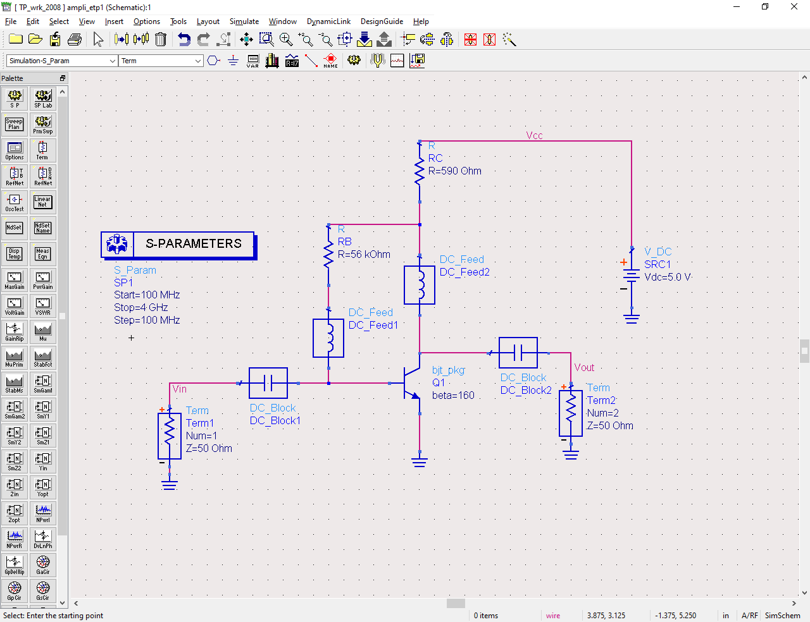
Figure 1: Schéma du circuit avec éléments idéaux

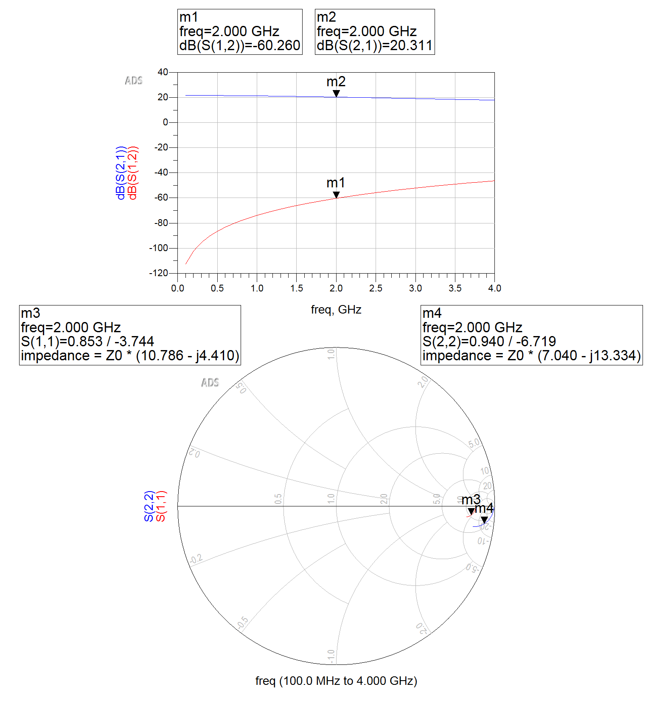
Figure 2: Mesures faites sur notre circuit

On voit qu'avec nos composants idéaux, on a :

- $S_{11}$ (Coefficient de réflexion en entrée) = $0.853 \over -3.744$
- $S_{12}$ (Isolation entre la sortie et l'entrée) = $-60dB$
- $S_{21}$ (Gain entre la sortie et l'entrée) = $20dB$
- $S_{22}$ (Coefficient de réflexion en sortie) = $0.940 \over -6.719$

## 3 - Remplacer les éléments idéaux par des éléments réels et simuler

1. <u>Valeur de condensateur</u> :
   $$
   \begin{aligned}
     |Z_C| = {{1} \over {C \times \omega}} \newline
     |Z_C| = 0.1 \times 50 = 5 \Omega
     \newline
     5 = {1 \over {C \times 2\pi \times 2\times 10^9}}
     \newline
     C = {1 \over {5 \times 2\pi \times 2\times 10^9}} = 15,9pF
   \end{aligned}
   $$
   Le rôle du composant est de bloquer le signal RF tout en laissant passer le signal DC pour alimenter le transistor sans perdre le signal RF.

2. <u>Valeur de bobine</u> :
   $$
   \begin{aligned}
     |Z_L| = {30 \times 50} = 1500 \Omega \newline
     |Z_L| = L \times \omega = L \times 2\pi \times 2 \times 10^9
     \newline
     L = {1500 \over {2\pi \times 2\times 10^9}} = 119,3 nH
   \end{aligned}
   $$
   Le rôle du composant est de bloquer le signal DC tout en laissant passer le signal RF pour permettre l'amplification sans ajouter du bruit venant de l'alimentation DC du transistor.

Figure 3: Montage avec les éléments réels

Figure 4: Mesures de réflexion, de gain et d'isolation avec les éléments réels

<!-- omit in toc -->
### Analyse

   1. L'entrée n'est pas adaptée car nous avons une forte réflexion à notre fréquence de travail (environ -1 dB à 2GHz en entrée(S21 - Figure 4 - schéma rectangle)). Cela montre que notre circuit n'est pas adapté car on aurait dû avoir un baisse de la réflexion si il était adapté pour avoir mon d'interférences avec notre signal RF.
   2. L'impédance d'entrée à 2GHz est $ \omega = Z_0 \times ( 10,886 - j4,311) = 544,3 - j215,55$
   3. La sortie n'est pas adaptée car nous avons une forte réflexion à notre fréquence de travail (environ -1 dB à 2GHz en sortie (S22 - Figure 4 - schéma rectangle)). Cela montre que notre circuit n'est pas adapté car on aurait dû avoir un baisse de la réflexion si il était adapté pour avoir mon d'interférences avec notre signal RF.
   4. L'impédance de sortie à 2Ghz est $ \omega = Z_0 \times ( 16,047 - j11,190) =  802,35 -j559,5$
   5. Le gain à 2Ghz est d'environ 20 dB
   6. L'isolation à 2Ghz est -60 dB

## 4 - Utilisation de l'outil Smith Chart pour définir un réseau simple d'adaptation d'impédence

Les valeurs de L et C sont : $C = 226,11 fF \space\And\space L = 10,37\space nH$

En utilisant les valeurs d'impédance que nous avions trouvés précédemment :

Structure du réseau d'entrée :

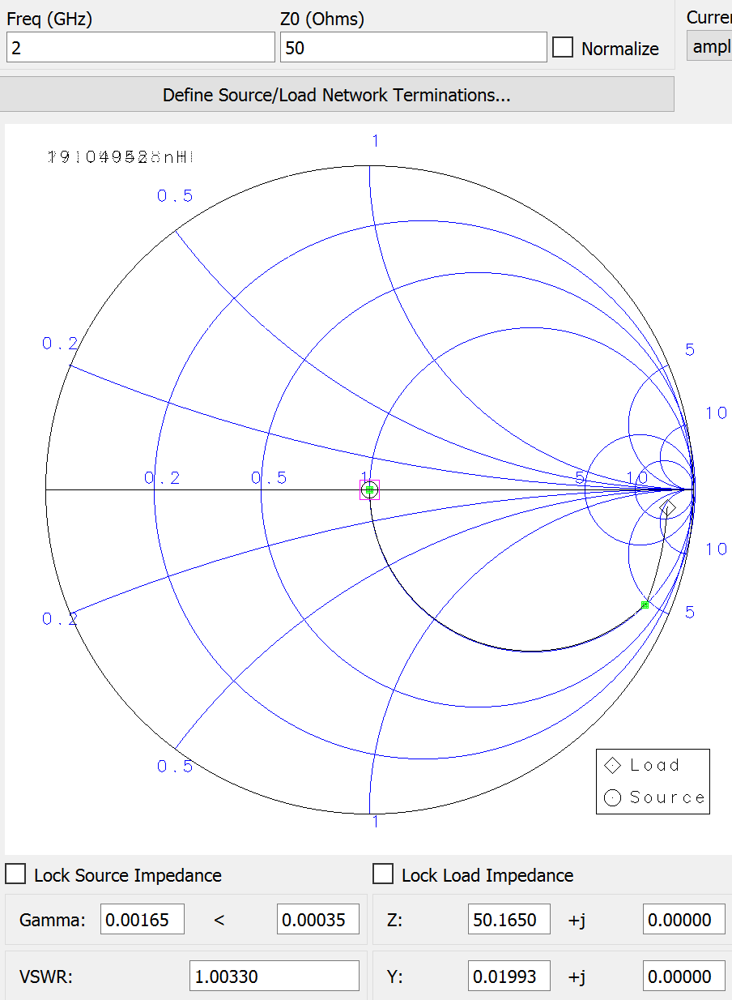

Figure 5: Adaptation de l'impédance en entrée avec l'outil Smith Chart{style="grid-row:2;text-align:left;}

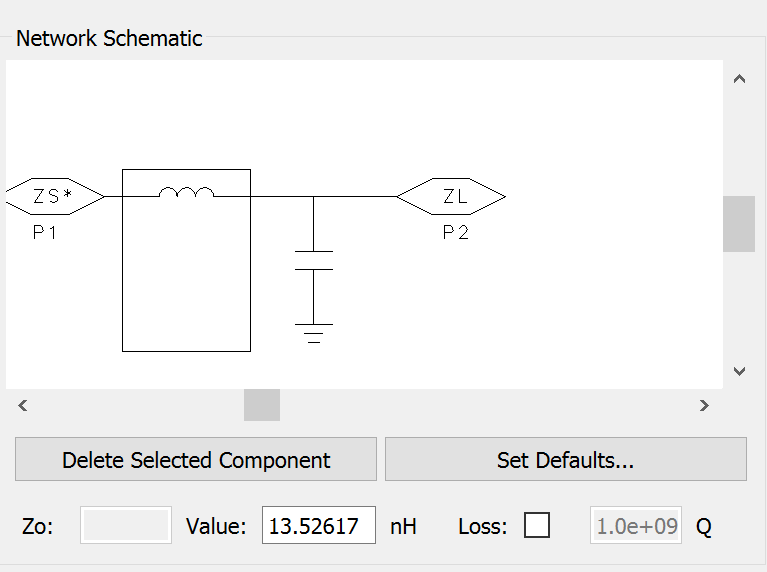

Figure 6: Mesure de l'inductance pour une adaptation à la main en entrée{style="grid-row:2;text-align:left;}

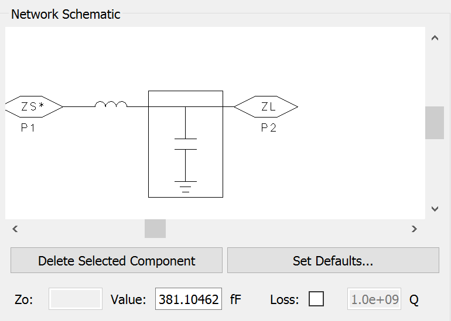

Figure 7: Mesure de la capacitance pour une adaptation à la main en entrée{style="grid-row:2;text-align:left;}

On a une structure en T avec un capaciteur (C) et une bobine (L) de valeur $381.10462$ fF et $13.52617$ nH.

Structure du réseau de sortie :

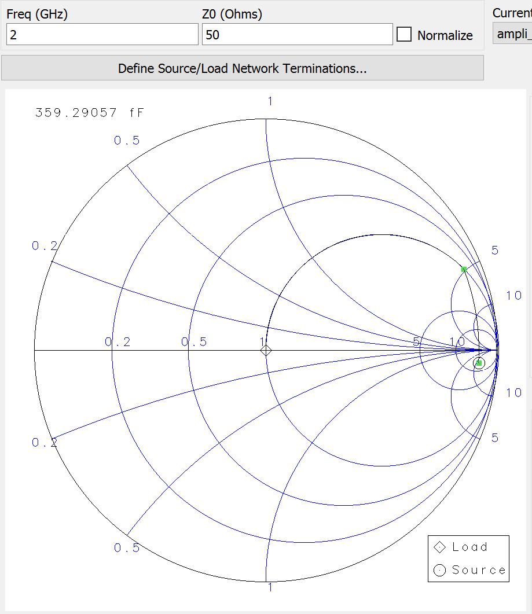

Figure 8: Adaptation de l'impédance en sortie avec l'outil Smith Chart{style="grid-row:2;text-align:left;}

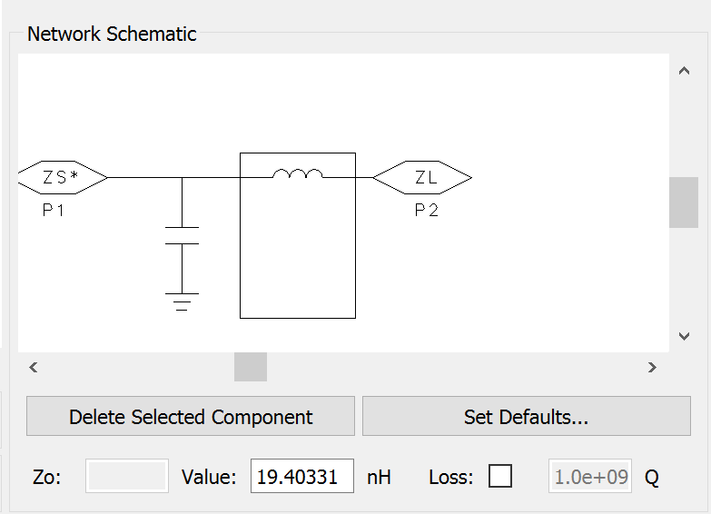

Figure 9: Mesure de l'inductance pour une adaptation à la main en sortie{style="grid-row:2;text-align:left;}

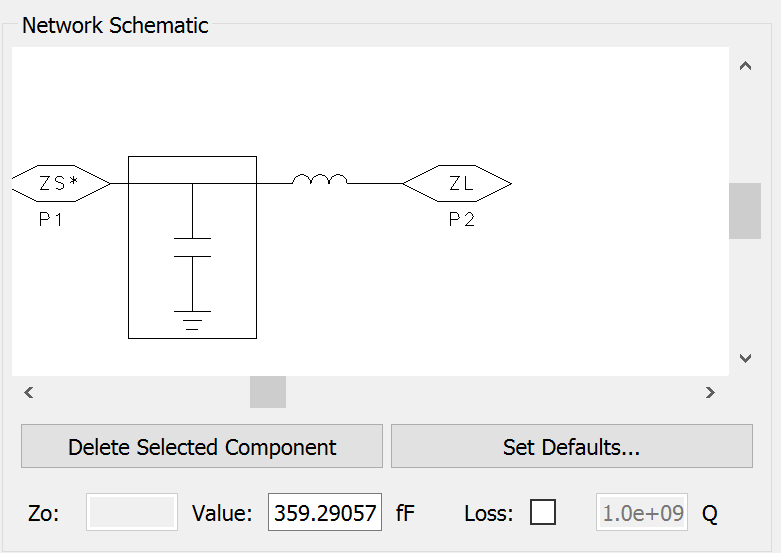

Figure 10: Mesure de la capacitance pour une adaptation à la main en sortie{style="grid-row:2;text-align:left;}

On a une structure en T avec un capaciteur (C) et une bobine (L) de valeur $359.29057$ fF et $19.40331$ nH.

Pour obtenir ces résultats, on entre nos valeurs dans ZL (pour adaptation en entrée) et ZS (pour adaptation en sortie). Une fois entrées, nos valeurs vont modifier la position du point dans l'abaque, l'objectif est, soit de ramener sa valeur au milieu (adaptation en entrée) ou d'amener l'entrée à la valeur de notre impédance (adapatation en sortie).
Pour l'adaptation en entrée, on utilise une bobine pour amener notre point sur la partie réelle (cercle concentrique inférieure (plus grand) le plus proche) et de ce cercle, on amène notre valeur au centre de l'abaque avec un capaciteur.

## 5 - Simuler le montage avec un réseau d'adaptation d'entrée et de sortie

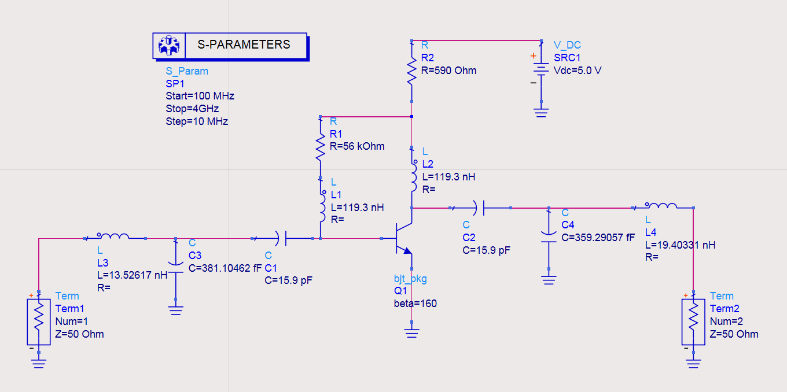{style="width:50vw;"}
Figure 11: Montage avec les composants d'adaptation avec les valeurs précédemment calculées

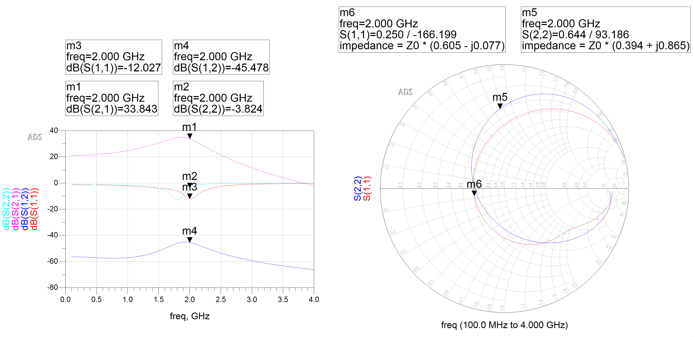{style="width:66%;"}
Figure 12: Mesures des coefficients de réflexion avec les composants adaptés à la main

S(1,1) = Coefficient de réflexion en entrée
S(2,2) = Coefficient de réflexion en sortie

- L’adaptation d’entrée du montage s’est-elle améliorée ? Oui, on a bien une baisse de la réflexion à -18 dB (environ) à 2Ghz (figure 12 - S(1,1)), ce qui montre qu'on est mieux adapté qu'avant (nous n'avions aucune baisse de la réflexion à notre fréquence).
- L’adaptation en sortie du montage s’est-elle améliorée ? Oui, on a bien une baisse de la réflexion à -18 dB (environ) à 2Ghz (Figure 12 - S(2,2)), ce qui montre qu'on est mieux adapté qu'avant (nous n'avions aucune baisse de la réflexion à notre fréquence).
- Quel est le gain du montage à 2 GHz? On voit sur la Figure 12 qu'on a un gain de 33dB à 2Ghz (S(1,1)), ce qui est mieux qu'avant car l'amplificateur est mieux conforme à sa fonction d'amplification à notre fréquence.
- Quelle est l’isolation du montage à 2 GHz? On voit sur la Figure 12 que l'isolation (S(1,2)) à 2Ghz est de -45dB à notre fréquence de travail et -60 dB en moyenne pour toutes les autres. Cette situation est idéale car elle isole mieux les fréquences "inutiles" (différentes de 2GHz) et laisse passer celle que l'on veut recevoir en sortie de notre montage.

## 6 - Optimisation des composants des réseaux d'adaptation

Pour faire l'optimisation sur ADS 2023 :
Il faut utiliser les GOAL comme dans l'énoncé, mais les "RangeMin" et "RangeMax" doivent être définis dans chaque composant individuellement via un clic droit sur le composant, "Tune/Opt/Stat/DOE Setup...", "Optimization", "Optimization Status" -> "Enabled", et on insère nos valeurs.

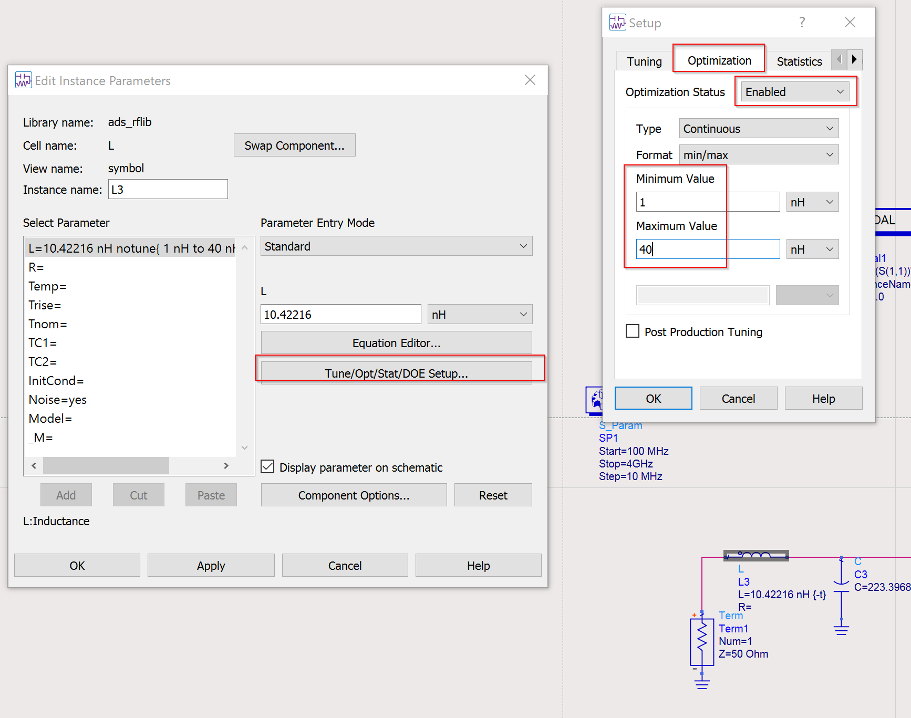
Figure 13: Menu pour régler l'optimisation sur un élément

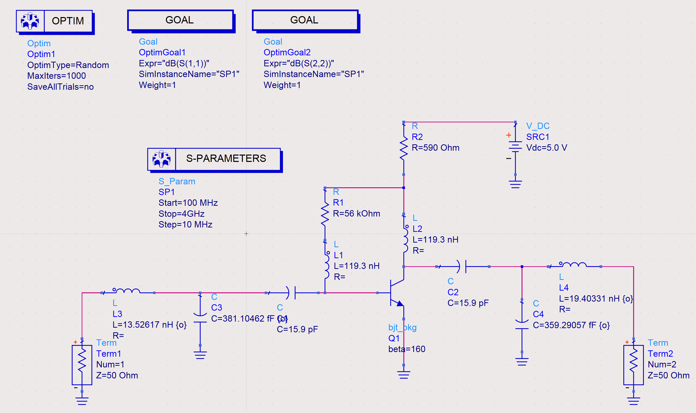
Figure 14: Montage avec les éléments d'optimisation

Pour définir les objectifs en dB dans la version 2023, il faut aller dans les paramètres du Goal, définir la "sweep variable" en "freq", changer le type de limite de ">" en "<" car on veut que notre gain et notre isolation supérieur à -20 dB à notre fréquence de travail. Pour spécifier les fréquences il suffit d'indiquer les fréquences min et max (ici 1900MHz et 2100MHz respectivement puisque nous avons une fréquence donnée de 2GHz).

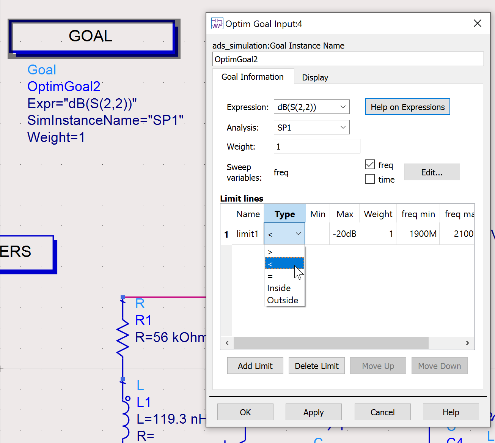
Figure 15: Menu pour régler les objectifs d'optimisation dans un élément donné

Voilà les résultats de l'optimisation après 1000 itérations :
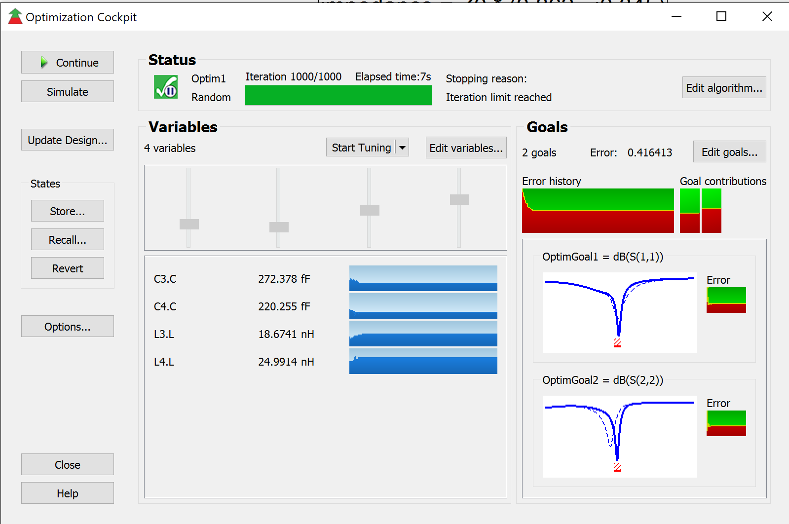
Figure 16: Menu "Cockpit" avec 1000 itérations pour optimiser les valeurs

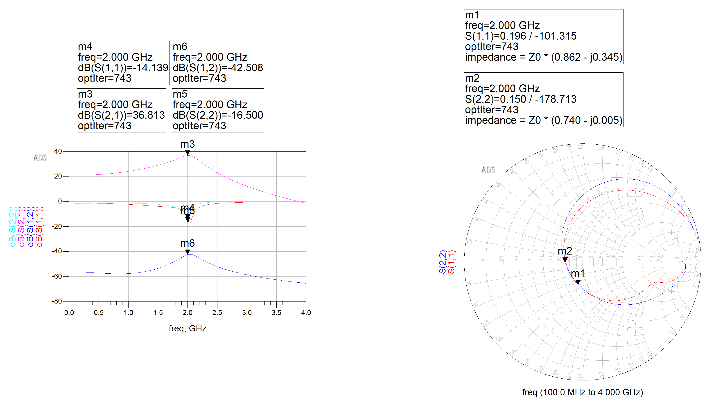
Figure 17: Mesures des coefficients de réflexion avec les composants adaptés avec l'optimisation

- L’adaptation d’entrée du montage s’est-elle améliorée ? Oui, on voit que les réflexions sont bien réduites spécifiquement sur 2GHz et pas à peu près 2GHz, le gain et l'isolation sont également mieux centrés sur cette fréquence. On peut l'observer sur la figure 17, courbe S(1,1) - m4.
- L’adaptation en sortie du montage s’est-elle améliorée ? De la même manière que l'isolation en entrée, la sortie) aussi beaucoup moins de réflexion en sortie. On l'observe sur la figure 17, courbe S(2,2) - m5, il y a -18 dB pile poil sur 2GHz, ce qui est plus précis que l'adaptation à la main.
- Les performances de votre circuit respectent elles les
objectifs d’optimisation ? Presque, on a bien une réduction de notre réflexion à -16dB à 2GHz, ce qui n'est pas loin de -20dB mais pas tout à fait ce qu'on souhaitait.
- Quel est le gain du montage à 2 GHz? Le gain de notre montage à 2GHz est de 36dB (Figure 17 - S(2,1) m3).
- Quelle est l’isolation du montage à 2 GHz? L'isolation de notre montage à 2 GHz est de -42dB (Figure 17 - S(1,2) - m6)

Une fois optimisé, voilà le schéma qu'on obtient :

Figure 18: Montage avec les valeurs d'adaptation optimisées

On voit sur le montage que les valeurs obtenues sont plus précises.

Les mesures obtenues avec sont celles affichées dans la Figure 17.

## Conclusion

En conclusion, ce projet a permis de créer un schéma pour un transistor polarisé en continu en utilisant des composants idéaux, de simuler et de mesurer le circuit, de remplacer les composants idéaux par des composants réels et de simuler à nouveau, d'utiliser le diagramme de Smith pour créer un réseau d'adaptation d'impédance simple, de simuler le circuit avec des réseaux d'adaptation d'entrée et de sortie et d'optimiser les composants des réseaux d'adaptation.

Les résultats obtenus montrent que la simulation avec des composants réels donne des résultats proches de la réalité. Les coefficients de réflexion en entrée et en sortie, ainsi que le gain et l'isolation ont été mesurés, et ont montré des valeurs proches de celles attendues. Le réseau d'adaptation d'impédance a également permis d'améliorer les performances du circuit, en augmentant le gain et en réduisant les coefficients de réflexion en entrée et en sortie.

Cependant, il est important de noter que ces résultats sont obtenus en utilisant des composants idéaux, il est donc important de continuer à tester avec des composants réels pour obtenir une analyse plus précise.

En résumé, ce projet a été une occasion pour nous de mettre en pratique nos connaissances sur les réseaux d'adaptation d'impédance. Nous avons pu constater que les résultats obtenus étaient conformes à nos attentes.

