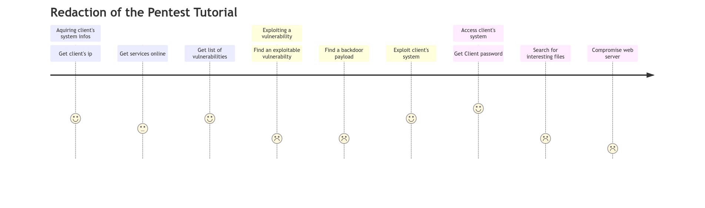
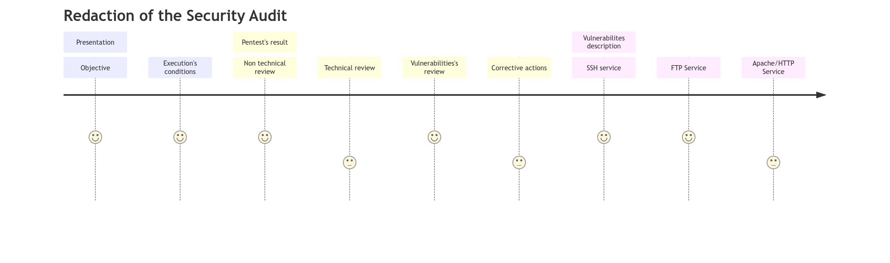

# Technical review <!-- omit in toc -->

by HARTMANN Matthias

## Table of Content <!-- omit in toc -->

1. [Presentation of the context](#presentation-of-the-context)
2. [Presentation of the technology of the project](#presentation-of-the-technology-of-the-project)
3. [Presentation of solution put into place and tools used](#presentation-of-solution-put-into-place-and-tools-used)
4. [Presentation of medium used](#presentation-of-medium-used)
5. [Review of decisions](#review-of-decisions)
6. [Management of the project](#management-of-the-project)

## Presentation of the context

## Presentation of the technology of the project

## Presentation of solution put into place and tools used

## Presentation of medium used

## Review of decisions
<!-- Describe what the maps represent -->

## Management of the project

<!-- TODO: Create a new gantt -->

{style="background-color:white;"}
