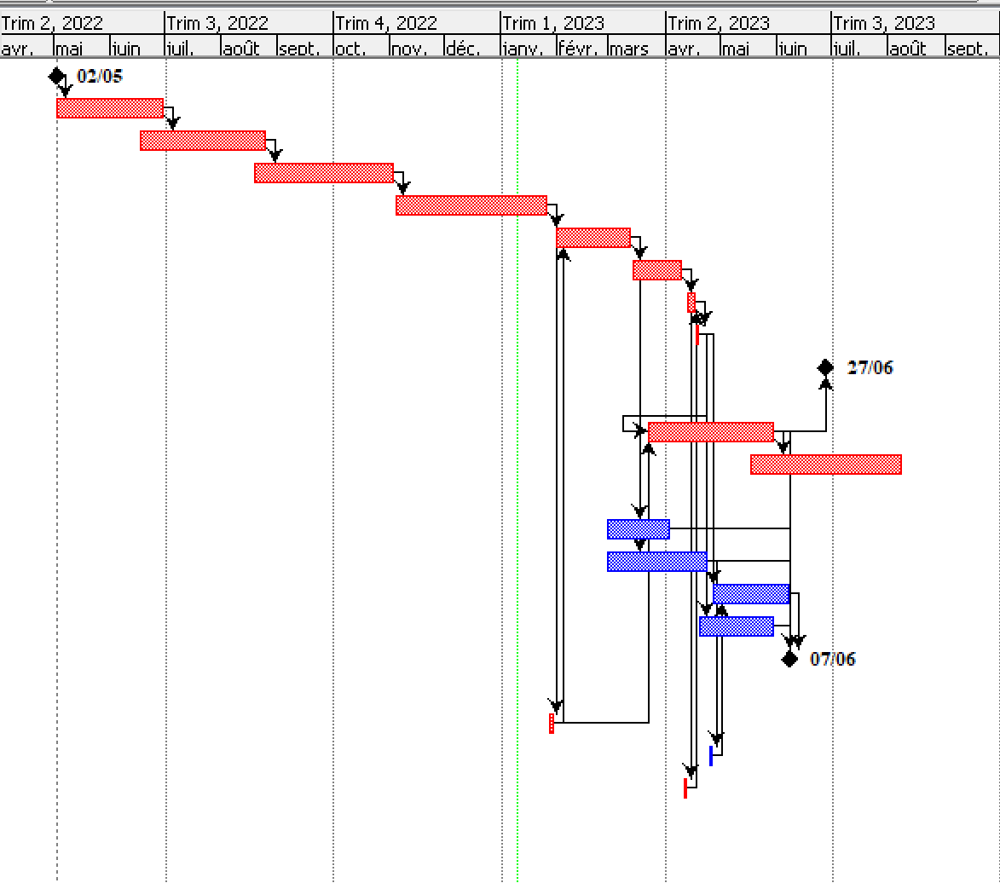
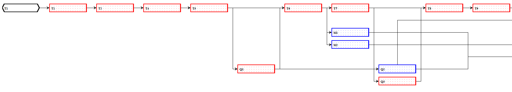
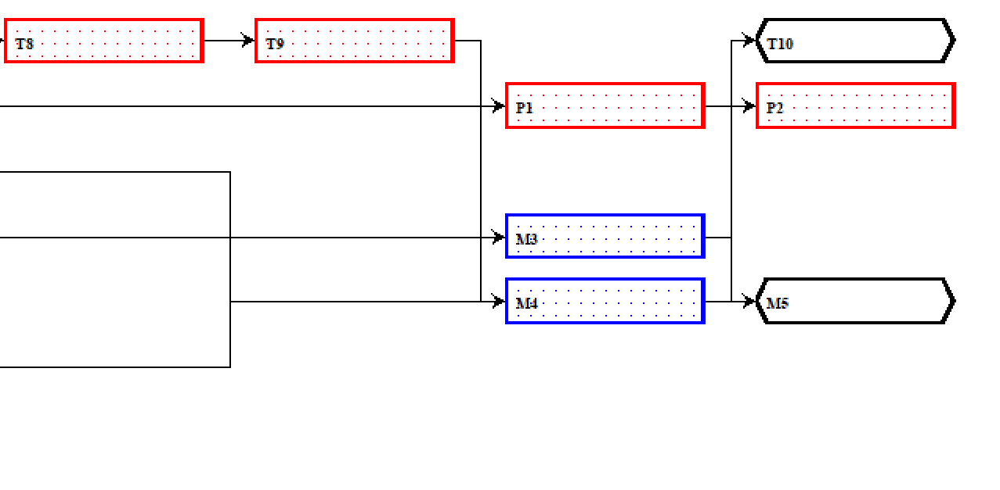
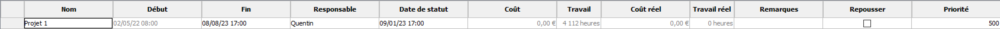
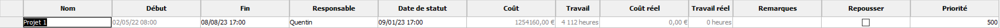
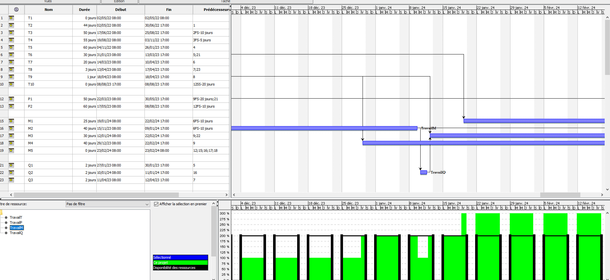
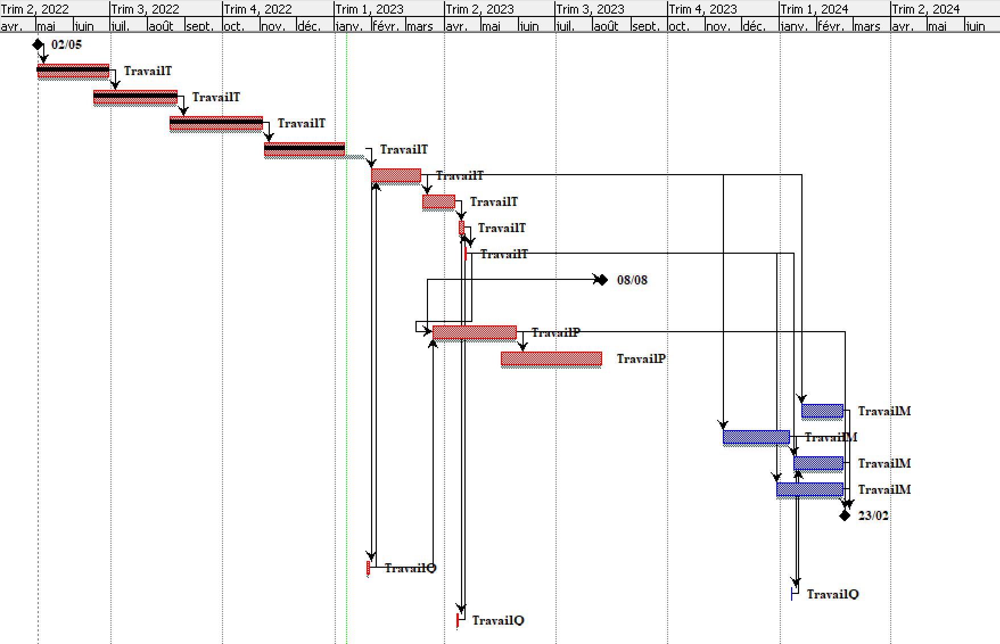
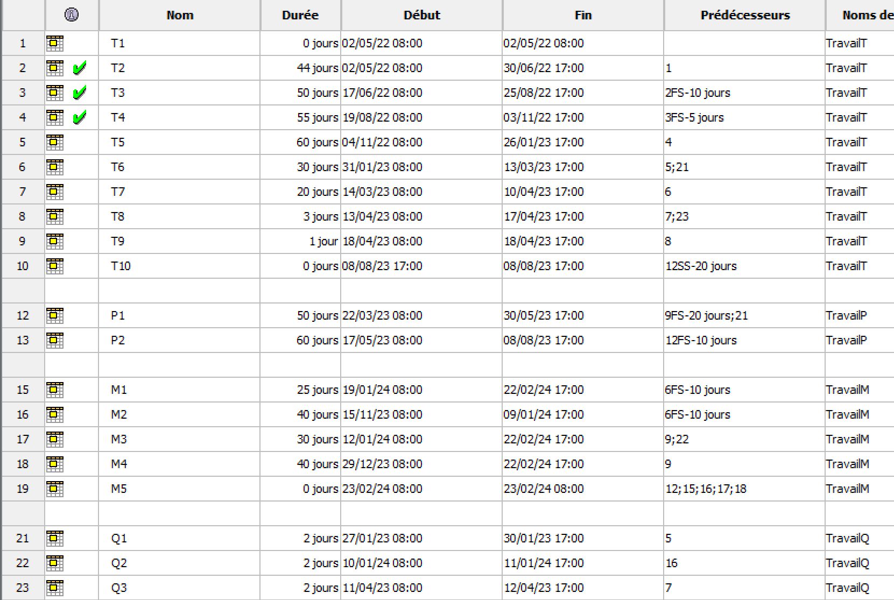

# Compte rendu TP Gestion de Projet : Découverte d'un outil de gestion de projet. <!-- omit from toc -->

> Par Matthias HARTMANN et Quentin NOILOU

## Table des matières <!-- omit from toc -->

1. [Introduction](#introduction)
2. [Déroulement du TP](#d%C3%A9roulement-du-tp)
   1. [Question 1](#question-1)
   2. [Question 2](#question-2)
   3. [Question 3](#question-3)
   4. [Question 4](#question-4)
   5. [Question 5](#question-5)
   6. [Question 6](#question-6)
   7. [Question 7](#question-7)
   8. [Question 8](#question-8)
3. [Conclusion](#conclusion)

## Introduction

Dans cet Travail Pratique, nous allons utiliser ProjectLibre pour mettre en place et suivre un projet. ProjectLibre est un logiciel de gestion de projet qui vous permet de planifier, de suivre et de contrôler les différentes tâches et activités d'un projet. Nous allons utiliser les différentes fonctionnalités de ProjectLibre pour définir les tâches du projet, affecter les ressources, établir les délais et suivre l'avancement du projet.

Au cours de ce TP, nous allons également apprendre à gérer les différents aspects de la gestion de projet, tels que la planification, la gestion des ressources, la gestion des budgets et la gestion des risques. Nous allons également étudier les différents outils et techniques utilisés dans la gestion de projet, tels que le diagramme de Gantt et l'analyse de chemin critique.

## Déroulement du TP

### Question 1

> Citez les différents types d'organisation qui existent pour une entreprise.

- Organisation linéaire ou hiérarchique: cette structure est basée sur une chaîne de commandement avec un chef au sommet et des employés sous sa supervision.
- Organisation en réseau: cette structure est basée sur des partenariats et des collaborations avec d'autres entreprises ou organisations.
- Organisation en matrice: cette structure combine les aspects de l'organisation linéaire et de l'organisation en réseau, avec des employés travaillant sur plusieurs projets et en collaboration avec différents départements.
- Organisation en étoile: cette structure est basée sur des équipes autonomes et indépendantes, qui travaillent ensemble pour atteindre des objectifs communs.
- Organisation en projets: cette structure est basée sur la réalisation de projets spécifiques, avec une équipe de travail temporaire composée d'employés de différents départements.
- Organisation en Lean Startup: cette structure est basée sur l'agilité et l'innovation, avec une forte culture d'expérimentation et de test, et une focalisation sur les besoins du client.

> Indiquez le type d'organisation que vous comptez mettre en place

Nous allons mettre en place une organisation en matrice.

### Question 2

> Saisissez les différentes tâches associées à chaque partie de votre organisation

> Lors de la création d’un projet, il y a le choix entre la saisie d'une date de début, ou la saisie d'une date de fin.
> Comment s’appelle le planning proposé dans ce dernier cas ?

Le `planning rétroactif` ou `rétro-planning` est un planning où on définit un date de fin souhaitée. Puis les tâches sont organisées à rebours afin d'atteindre l'objectif final. De cette façon on assure le respect des délais et des échéances.

### Question 3

> Citez les 4 types de liaisons des tâches possibles

- Liaison de début à début (SS): cette liaison indique que la tâche suivante démarrera dès que la tâche précédente sera terminée.

- Liaison de fin à fin (FF): cette liaison indique que la tâche suivante se terminera en même temps que la tâche précédente.

- Liaison de début à fin (SF): cette liaison indique que la tâche suivante commencera dès que la tâche précédente sera terminée et se terminera à une date fixée.

- Liaison de fin à début (FS): cette liaison indique que la tâche suivante ne démarrera que lorsque la tâche précédente sera terminée.

> Faites une copie-écran de votre planning dans votre compte rendu.

> Vous remarquez très certainement que votre projet ne démarre pas le 1er mai. Pourquoi ?

C'est dû au fait que le $1^{er}$ mai est un jour férié.

> ProjectLibre vous propose une vue en mode Calendrier (Gantt) et une vue en mode réseau (PERT = Program
> Evaluation and Review Technique). Tracez le PERT du projet (ou faites une copie-écran)

> Préciser la légende de ProjectLibre

Les tâches critiques sont entourées en Rouge. Les tâches non critiques sont en bleu et les jalons sont en noir.

> A quoi servent les 'jalons' ?

Les jalons sont des points de repère importants dans un projet qui indiquent le progrès et l'avancement du projet. Ils peuvent être utilisés pour définir les étapes clés d'un projet et pour suivre l'avancement du projet par rapport aux objectifs fixés.

> Qu'est-ce qu'une tâche critique ?

Une tâche critique est une tâche qui doit être terminée à temps pour que le projet puisse être terminé dans les délais prévus. Les tâches critiques sont souvent déterminées en utilisant une technique appelée analyse de chemin critique, qui consiste à identifier les tâches qui ont le plus grand impact sur la durée totale du projet.

### Question 4

> Qu'appelle-t-on chemin critique ?

Le chemin critique est le chemin le plus long à travers les tâches d'un projet qui détermine la durée totale du projet. Il s'agit des tâches qui doivent être terminées de manière à ce que le projet puisse être terminé dans les délais prévus.

> Comment le calculer ?

On additionne la durée (en jour) de chaque tâche critique en veillant à ne pas ajouter les jours superposés entre plusieurs tâches critiques.

> Donnez la liste des tâches qui forment le chemin critique dans notre exemple, et calculez-le.

Le chemin critique est composé des tâches suivantes :
T1, T2, T3, T4, T5, T6, T7, T8, T9

Pour un total de 332 jours de travail.

> Donnez la date de fin qui a été calculée pour votre projet, ainsi que le nombre d'heures de travail ?

La date de fin calculé est le `8 juillet 2023`.
Il y a 4 112 heures de travail dans ce projet.

### Question 5

> Quelle est la nouvelle date de fin de projet ? A-t-elle changée ?

La nouvelle date de fin de projet est le `8 juillet 2023`. Elle n'a pas changé.

> Donnez les informations suivantes : la durée du projet, le nombre d'heures de travail, ainsi que son coût

Le projet débute le 2 mai 2022 et fini le 8 juillet 2023. Il y a 4 112 heures de travail comptabilisé pour un coût total de 1 254 160,00€

> On dit que la courbe CBTP (Coût Budgété du Travail Prévu) d’un projet est en forme de « S ». Pourquoi ?

La courbe CBTP d'un projet est en forme de "S" car elle reflète généralement l'évolution du coût budgété du travail prévu au fil du temps. Au début d'un projet, le coût budgété du travail prévu est généralement faible, car les tâches sont encore à un stade précoce et nécessitent moins de travail et de ressources. Au fil du temps, le coût budgété du travail prévu augmente généralement, car les tâches deviennent plus complexes et nécessitent plus de travail et de ressources. Vers la fin du projet, le coût budgété du travail prévu recommence à diminuer, car les tâches sont terminées et les ressources sont libérées.

> Finalement, votre entreprise ne compte que 2 ressources 'Travail' (par département) avec la configuration précédente. Cela pose-t-il un problème ? Si oui, lequel ?

Oui cela pose un problème au niveau des tâches M. Le projet nécessiterait 3 personne mais seulement 2 seraient disponibles.

### Question 6

> Mettez à jour le projet à la date d'aujourd'hui. Que constatez vous dans la vue du diagramme de Gantt ?

On remarque que certaines tâches possèdent désormais un trait noir indiquant qu'elles sont complétées.

> Listez les éléments à travers lesquels vous pouvez voir l'avancement de votre projet dans les propriétés du projet.

Les tâches T2, T3 et T4 ont été complétées.

### Question 7

> Quelles sont les conséquences pour notre projet ?

Le projet devra être mis en suspend car le département Production (département concerné par la tâche en cours) ne pourra assurer son travail

> Définissez le terme `dérive budgétaire` ?

La dérive budgétaire se réfère à une différence entre le coût réel d'un projet et le coût budgété prévu. La dérive budgétaire peut être positive ou négative. Une dérive budgétaire positive signifie que le coût réel du projet est inférieur au coût budgété prévu, tandis qu'une dérive budgétaire négative signifie que le coût réel du projet est supérieur au coût budgété prévu

### Question 8

> Si l’entreprise ferme au moins 4 semaines, est-ce que le chemin critique reste le même que celui défini dans la question 4 ?

Le chemin critique reste le même car la tâche critique T4 sera concerné par la fermeture de l'entreprise.

> Vous êtes le chef du projet, avez vous une solutions à proposer ?

La tâche T4 est une tâche d'analyse et conception produite par le département Technique. Cette tâche peut donc potentiellement être effectuée en télétravail. Cependant, les 4 semaines de pauses déborderaient sur la tâche 5 qui est une tâche de Production de prototype qui ne pourrait pas être faite en télétravail (Besoin d'outils techniques).

> Que faut-il vraiment prévoir en amont ?

Il faut prévenir le client du retard occasionné par l'arrêt temporaire du projet. De plus du côté de l'entreprise il faut pouvoir télétravail. Cela comprend donc un logiciel de communication entre les salariés, un stockage commun etc.

## Conclusion

> Qu'avez vous appris dans ce TP ?

Nous avons appris à utiliser le logiciel ProjectLibre afin de mettre en place une gestion de projet. L'utilisation de ce logiciel nous permet de prévoir la durée de projet, le nombre de tâches, la répartition des ressources. Ce logiciel permet aussi de gérer la gestion des risques en observant l'impacte qu'aurait un retard sur le projet. Enfin le logiciel permet d'obtenir le coût du projet.

Nous avons aussi appris du vocabulaire technique comme :

- Dérive Budgétaire
- PERT
- Rétro-planning
- Jalon
- etc.
